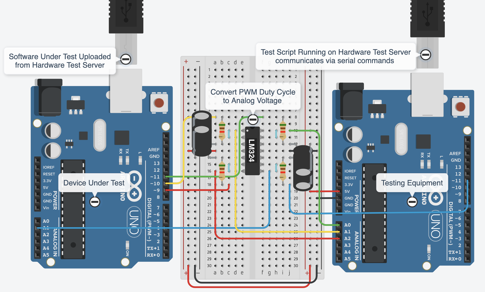
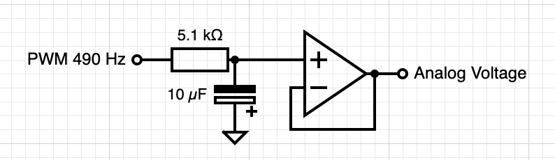
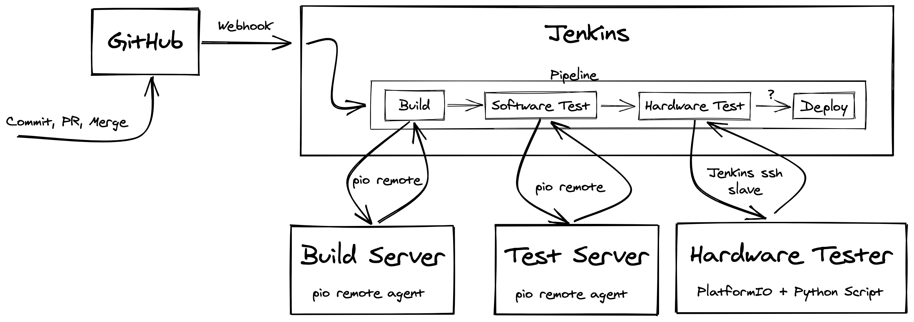
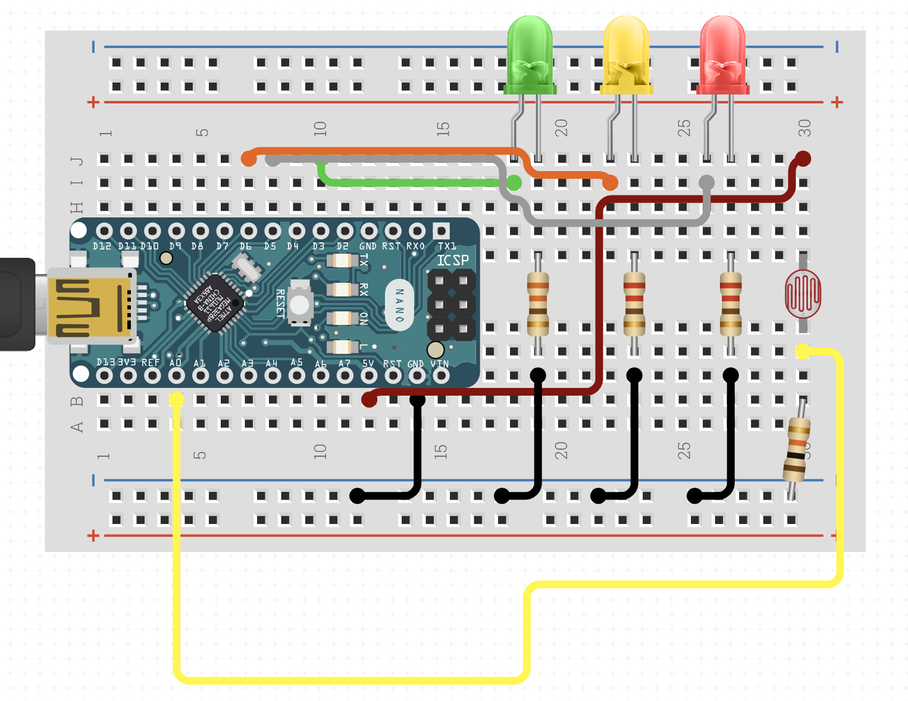

[](https://github.com/Callet91/DEMO_Jenkins_PlatformIO/blob/master/LICENSE)


<br />
<p align="center">
  <a href="https://github.com/Callet91/DEMO_Jenkins_PlatformIO">
    
  </a>

  <h3 align="center">Demo: Using Jenkins and PlatformIO</h3>

  <p align="center">
    A simple demo showing how to setup a continuous integration pipeline for development on embedded devices, specifically single-board microcontrollers, e.g. the Arduino family.
    <br />
    <a href="https://www.youtube.com/watch?v=7JVxvhcz8Go"><strong>View demo in action [YouTube] »</strong></a>
    <br />
    <br />
    <a href="#how-it-was-made">Explore how it was made</a>
  </p>
</p>

## Table of Contents

* [About the Demo](#about-the-demo)
  * [Motivation](#motivation)
  * [Tools Used](#tools-used)
* [How it was made](#how-it-was-made)
  * [Setting Up the Tools](#setting-up-the-tools) 
    * [Jenkins Server](#jenkins-server)
    * [Build Server](#build-server)
    * [Test Server](#test-server)
    * [Hardware Test Server](#hardware-test-server)
  * [Pipeline Overview](#pipeline-overview)
    * [Build Step](#build-step)
    * [Software Test Step](#software-test-step)
    * [Hardware Test Step](#hardware-test-step)
    * [Deploy Step](#deploy-step)
  * [Final Product](#final-product)
* [What is next](#what-is-next)
* [License](#license)
* [Contact](#contact)
* [Acknowledgements](#acknowledgements)

## About The Demo

This demo aims to show how tools like **Jenkins** and **PlatformIO** can be easily used to setup a working continues integration pipeline, enabling both automatic unit testing and hardware testing. 

Specifically this demo shows how to setup a **Jenkins** automation server, and then using the Blueocean plugin to setup a pipeline for automated testing using **PlatformIO**

### Motivation

When developing for embedded systems, tests that relate to the actual hardware are often done manually on a dedicated test rig. This is time consuming and often creates a bottleneck in the workflow since only small teams can work on the test rig, one at a time. Automation of physical tests could hopefully reduce the time spent in the lab and speedup verification of the code under test.

Also this greate article: [Continuous Delivery, Embedded Systems, and Simulation](https://blogs.windriver.com/wind_river_blog/2018/03/continuous-delivery-embedded-systems-and-simulation/) by Jakob Engblom
>Mike Long’s most important message is really that software development methods and tools matter, and that being “embedded” is no excuse not to work in a modern and efficient way.  

### Tools Used

* [Jenkins](https://www.jenkins.io/)
  * >Jenkins is a self-contained, open source automation server which can be used to automate all sorts of tasks related to building, testing, and delivering or deploying software.
    >
    >Jenkins can be installed through native system packages, Docker, or even run standalone by any machine with a Java Runtime Environment (JRE) installed.
    
    [Docs »](https://www.jenkins.io/doc/)
* [Blueocean Plugin](https://www.jenkins.io/projects/blueocean/)
  * A tool for building and visulizing **Jenkins** pipelines.
* [PlatformIO](https://platformio.org/)
  * >PlatformIO is a cross-platform, cross-architecture, multiple framework, professional tool for embedded systems engineers and for software developers who write applications for embedded products.
    
    [Docs »](https://docs.platformio.org/en/latest/index.html)


## How it was made

In this section we will go over how this demo was made. It will not explain every step fully but will provide enough information that anyone should be able to recreate a version of this demo, even if they do not run it on the same type of servers or with the same embedded devices.

### Setting Up the Tools

First we will provide resources so that you can setup all the required servers. In this demo pipeline we require four servers. All these servers could be run on the same computer using some container software like Docker. 

The server setup in the demo video is as follows:
* Jenkins server ran on a Raspeberry Pi running Raspbian
* Build server ran in a Docker container on a Ubuntu laptop
* Test server ran on a MacOS laptop
* Hardware test server / Jenkins SSH slave agent ran on a (different) Raspeberry Pi running Raspbian

 #### Jenkins Server

There are many ways to setup a **Jenkins** server. It can run on most devices that can run the Java Runtime Environment (JRE). Docker is one of the easiest ways of starting a **Jenkins** server. 
* [Download Jenkins](https://www.jenkins.io/download/)
* [Installing Jenkins](https://www.jenkins.io/doc/book/installing/)

One caveat is that this server must also run **PlatformIO**. **PlatformIO** is python based and **PlatformIO Remote**  which is the only thing this server will use does not require the ability to compile and run a microcontroller compile suite, e.g. `avrdude`, `avr-gcc` etc. 
Note for example if you run **Jenkins** using their lts docker image it will run on alpine linux. At the current time **PlatformIO** cannot download the correct toolchain for atleast the Atmel/Microship chipsets. 

Next you will add the blueocean plugin. There is a compleate docker image availiable with Jenkins+Blueocean already setup. Just be aware of the caveat above.
* [Blue Ocean Setup](https://www.jenkins.io/doc/book/blueocean/getting-started/)
* [Creating a Pipeline](https://www.jenkins.io/doc/book/blueocean/creating-pipelines/)

When creating a pipeline you will directly connect it to your GitHub repo.

To be able to recive webhooks from GitHub you will have to add `http://ipAddress:port/github-webhook/` to your GitHub repo. Where `ipAddress:port` is the address where your **Jenkins** server is accessable from. A simple way to make a `localhost` port available to the internet is using a software like [ngrok](https://ngrok.com/)
* [Add GitHub Webhook to Jenkins Pipeline using ngrok](https://dzone.com/articles/adding-a-github-webhook-in-your-jenkins-pipeline)

Now to setup **PlatformIO**. The CLI supports most common OSs. However it does not guarantee that a specific OS supports some specific toolchain. However on this server we are only using **PlatformIO Remote** or `pio remote`.
* [Installing PlatformIO](https://docs.platformio.org/en/latest/core/installation.html)

Caveat when using `pio remote` every agent and client must use the same version of Pyhton, i.e. `Python2` or `Python3`.

 #### Build Server

 The build server only needs to install **PlatformIO**. The same procedure as for the **Jenkins** server apply here. Only with the extra requirement that this server must be able to build the project using the required toolchain. For **AVR** projects **Windows**, **MacOS**, and **Ubuntu**/**Debian**-like OS will work (including **ARM** based once like **Rasbian**). Because this server will run a **PlatformIO Remote Agent** you must create an account and login to **PIO**.
 You can then run this script to generate a token which can be used by the **Jenkins Server** to send commands via `pio remote`.
 ```sh
pio account login
pio account token
```
* [`pio account` docs](https://docs.platformio.org/en/latest/plus/pio-account.html)

We also need to add this token as a Jenkins Credential. In the demo this is a *secret text* called `BUILD_TOKEN`.
* [Using Credentials](https://www.jenkins.io/doc/book/using/using-credentials/)

You can then start the remote agent with:
```
pio remote agent start
```
* [`pio remote agent` docs](https://docs.platformio.org/en/latest/core/userguide/remote/cmd_agent.html)

For the demo video we used the following [Dockerfile](Dockerfile) and [docker-compose.yml](docker-compose.yml)

##### Platform Remote Overview 


The image above is an overview of how **PlatformIO Remote** works. But the idea is that you have the two (green) entites in the middle, one *Agent* and one *Client*. Both are logged in to a **PlatformIO** account. A client (in this case the Jenkins Server) can then send commands via the **PIO Clound** to a *Remote Agent*. The remote framework makes sure that the relevant projects are in sync and can excute the commands on the *Remote Agent* (in this case a build command on the build server). The *Client* will then get the results of this command as if it ran the command locally. 

This is the system which enables us to use PIO in a scalable and automated manner. 

 #### Test Server

The setup here is exactly the same as for the Build Server. Only now we use a new account so we get a different token. We then setup a credential called `TEST_TOKEN`.

This test server has a couple of boards plugged in availiable. It will run both unit test nativly on the server as well on the embedded devices.

Which test are run where are defined inside the [`platformio.ini` file](platformio.ini).
* [PlatformIO Project Configuration File docs](https://docs.platformio.org/page/projectconf.html)

Inside here we can provide a selection of tests which each environment should ignore. For example the native test environment ignores all the tests in the `test_embedded` folder and the embeded environments ignore all the tests in the `test_native` folder. (The `megaatmega2560` environment ignores all tests as it is the environment we used to simulate deployment.)

When running `pio remote [test|run]` you may have to specify the upload port if **PlatformIO** can not identify where it is. We did it here for `nanoatmega328` environment. 

One note is that this can instead be passed as an argument to the command, that way multiple pio remote agents can be enabled even if they use different ports for their boards. So a script can be setup which first lists all availiable agents and devices, then specifies the specific agent and device port of the board of intrest.

 #### Hardware Test Server

 This server needs to have **PlatformIO** installed as well as be accessable via SSH. In the same way we made the webhook path availiable for the Jenkins server we can make the ssh port availiable for the Hardware Test server using an applicationg like [ngrok](https://ngrok.com/).
 We will setup this server as a **Jenkins** SSH slave agent.
 The **Jenkins** documentation has a howto on setting this up.
 * [Distributed Builds - Have master launch agent via SSH](https://wiki.jenkins.io/display/JENKINS/Distributed+builds#Distributedbuilds-Havemasterlaunchagentviassh)

 After this is setup we need to add this slave agent to Jenkins and give it a name, in the demo we called this slave `PlatformIO-slave`. 

##### Test Rig Setup

This section will take a step away from DevOps technologies and explain how the test rig was setup. 



This test rig provided a simple and cheap way for the Raspberry PI to check and interact with the final product. The final product had one analog voltage sensor input and three PWM digital output signals. 

We created a simple circuit consiting of a low-pass filter and a op-amp to convert the Arduinos' 490 hz PWM signals Duty cycle to an analog voltage that the other Arduino's ADC could interpret. 


Using the Test Equipment Arduino's USB port we could send commands to the Device Under Test (DUT). And read of the output values the DUT produced. 

With our abundance of Arduino boards this was the easiest way to interface the Raspberry PIs 3.3v world with the 5v world of the Arduinos. 

In a more serious test rig the Arduino board would be replaced by test equipment like oscilloscopes, source meters, power supplies and communicated with and controlled by using some standard like [LXI](https://en.wikipedia.org/wiki/LAN_eXtensions_for_Instrumentation) or [GPIB](https://en.wikipedia.org/wiki/IEEE-488).

But with the availiability of cheap single-board microcontrollers able to run full linux distributions it is quite easy to create a quite intricate test rig setup that can be easily automated for use in a CI pipeline.

### Pipeline Overview


So this picture shows the overall pipeline we will be using.

1. First Some Action trigger a GitHub webhook
2. Jenkins Recives Webhook and starts the pipeline
    1. Build
         * Send `pio remote` command to the Build Server
    2. Software Test 
         * Send `pio remote` command to the Test Server
    2. Hardware Test 
         * Run as SSH slave agent
         * Run commands directly on server via SSH
         * Executes python test script interacting with test rig
    2. Deploy
         * If this was a merge / commit to the master branch
         * then deploy
         * In the demo for simplicity we just used the slave agent to upload the new build to a specfic board. (Just as a proof of concept)

#### Build Step

```Jenkinsfile
stage('Build') {
    steps {
    sh '''pio account logout || true
PLATFORMIO_AUTH_TOKEN=${BUILD_TOKEN} pio remote run -r
'''
    }
}
```

This is the build step of the pipeline. It simply runs this shell script:
```sh
pio account logout || true
PLATFORMIO_AUTH_TOKEN=${BUILD_TOKEN} pio remote run -r
```
Because pio is stateful we must first logout to make sure that we are loged in using the right remote token.  (We use `or true` to make sure that even if the logout fails, which happens if we are not logged in, it does not stop the build).

Note that one could also use the same token for both the Test and Build server and simply specify the *agents* by name when running the `pio remote` command.

We then use the build token to login and authenticate the command. `pio remote run -r` simply forces the *remote agent* to build the project.

#### Software Test Step

```Jenkinsfile
stage('Software test') {
    steps {
    sh '''pio account logout || true
PLATFORMIO_AUTH_TOKEN=${TEST_TOKEN} pio remote test -e native -r'''
    sh '''pio account logout || true
PLATFORMIO_AUTH_TOKEN=${TEST_TOKEN} pio remote test -r'''
    }
}
```

This is the test step of the pipeline. It simply runs this shell script:
```sh
pio account logout || true
PLATFORMIO_AUTH_TOKEN=${TEST_TOKEN} pio remote test -e native -r
pio account logout || true
PLATFORMIO_AUTH_TOKEN=${TEST_TOKEN} pio remote test -r
```

This works the same way as in the buils step. However here we first just run the native tests and only if this succeeds do we run the test on the boards. This is done as running the native tests are generally much cheaper than the embedded tests, so if we have a failure on the native test we can exit early.

Note that prior to this (or even prior to the build step) we could have run `pio check` to run analysis tools on the code like `clangtidy`. As of yet this cannot be done via the `pio remote` system so it would either have to be done on the Jenkins server or on some slave agent similarly to the Hardware test described below.
* [PlatformIO Check docs](https://docs.platformio.org/en/latest/plus/pio-check.html)

#### Hardware Test Step

```Jenkinsfile
stage('Hardware test') {
    agent {
    label 'PlatformIO-slave'
    }
    steps {
    sh '''/home/jenkins/.local/bin/pio run -e uno -t upload --upload-port /dev/ttyUSB0
sleep 5
python test_scripts/check.py'''
    }
}
```

First this stage is instructed to only run on the `PlatformIO-slave` agent which is the name we gave the Hardware Test server. It then runs this shell script nativily on that server:
```sh
/home/jenkins/.local/bin/pio run -e uno -t upload --upload-port /dev/ttyUSB0
sleep 5
python test_scripts/check.py
```
First we use pio upload the application binary. Here we specify both the board environment and the port as the rig only tests an Arduino Uno board and the port is different from the default. 

After the application is flashed we wait for five seconds to make sure that the Arduino and application has started. 

When then excute a [test script](test_scripts/check.py) which communicates with the test rig and checks the correct behaviour of the output and input pins.

#### Deploy Step

```Jenkinsfile
stage('Deploy') {
    agent {
    label 'PlatformIO-slave'
    }
    when {
        branch "master"
    }
    steps {
    sh '''/home/jenkins/.local/bin/pio run -e megaatmega2560 -t upload --upload-port /dev/ttyUSB1
'''
    }
}
```

Here just as a proof of concet we added a deployment step. For this we simply had one more board plugged into the Hardware Test server and if the commit / merge was done to the master branch then we also deployed the application by uploading it to this board.

The Continious Deployment(CD) cycle for embedded devices is specific to the use case and final product. While many applications can enable some sort of CD and some would even benifit greatly from it, we acknowledge that there are also things in this field that makes CD less desirable or too complicated. There is however no excuse to not enable some sort of automation and CI in embedded development.

### Final Product

The final product looks something like this. The device will light three different LEDs (one green, yellow and red) with different light intesities based on the value of the LDR (light dependent resisitor) sensor. This is just a toy product to show the proof of concept of a CI pipeline for embedded device development. 


## What is next

Here we will propose some ways that someone could continue to contribute to CI/CD for embedded device development.

* Extend this demo to have a complete and proper Continious Deployment cycle
* Create a similar demo using a different automation framework, like GitHub Actions
* Extend this demo to include hardware simulations
* Create a more systematic way of creating a CI/CD ecosystem for embedded device development
* Work on creating a tool like PlatformIO but for Hardware Simulation software

## License

Distributed under the MIT License. See `LICENSE` for more information.

All logos used are owned by **Jenkins** and **PlatformIO** respectivly.

[pio-remote-architecture.png](images/pio-remote-architecture.png) is taken from PlatformIO docummentation and owned by them.

## Contact

Axel Boldt-Christmas - xmas1915@gmail.com

Carl Jensen - calle.jensen@outlook.com

Project Link: [https://github.com/Callet91/DEMO_Jenkins_PlatformIO](https://github.com/Callet91/DEMO_Jenkins_PlatformIO)


## Acknowledgements

* [DevOps course at KTH Royal Institute of Technology DD2482](https://github.com/KTH/devops-course) for which this demo was a submitted task.
     * Extra thanks Professors and TAs that made the course work even with distance learning due to COVID-19
        * [Prof. Martin Monperrus](http://www.monperrus.net/martin/)
        * [Prof. Benoit Baudry](https://softwarediversity.eu/)
        * [He Ye (TA)](https://www.kth.se/profile/heye)
        * [Long Zhang (TA)](http://gluckzhang.com/)
        * [César Soto (TA)](https://cesarsotovalero.github.io/)
* The greate docummentation and tools provided by both Jenkins and PlatformIO

